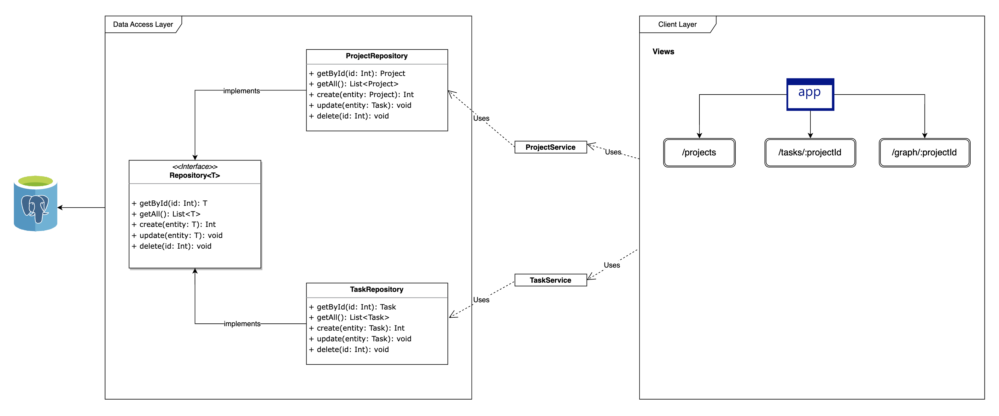
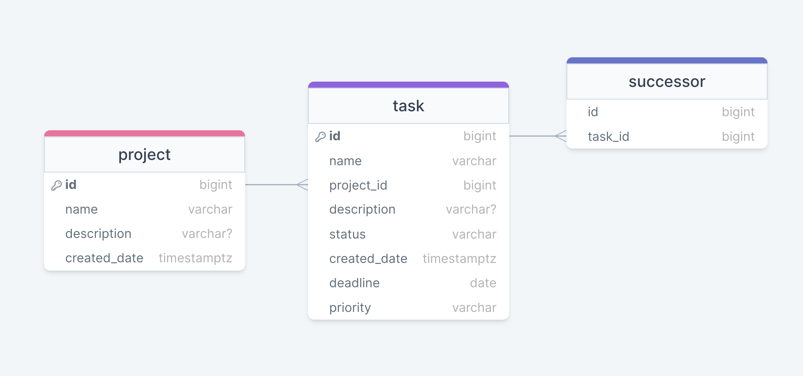

# Project Management System - Web Application

## Tech Stack

- **App Framework**: [Spring Boot](https://spring.io/projects/spring-boot)
- **Frontend**: [Vaadin Flow](https://vaadin.com/docs/latest/) - uses [Karibu-DSL](https://github.com/mvysny/karibu-dsl)
- **Database**: Postgres
- **Language**: Kotlin
- **Third-party libraries**: [Viz](https://vaadin.com/directory/component/viz) (Visualize graph
  structures), [Exposed](https://github.com/JetBrains/Exposed/) (Kotlin
  SQL Framework/ORM), [sortable-layout](https://github.com/jcgueriaud1/sortable-layout/) (drag and drop functionality)

## Running the Application

There are two ways to run the application :  using `mvn spring-boot:run` or by running the `Application` class directly
from your IDE.

#### Intellij IDEA

- On the right side of the window, select Maven --> Plugins --> `spring-boot` --> `spring-boot:run` goal
- Clicking on the green run button will start the application.
- After the application has started, you can view your it at http://localhost:8080/ in your browser.
- If you want to run the application locally in the production mode, use `spring-boot:run -Pproduction` command instead.

## Structure

Vaadin web applications are full-stack and include both client-side and server-side code in the same project.

| Directory                                   | Description                                                        |
|:--------------------------------------------|:-------------------------------------------------------------------|
| `frontend/`                                 | Client-side source directory                                       |
| &nbsp;&nbsp;&nbsp;&nbsp;`index.html`        | HTML template                                                      |
| &nbsp;&nbsp;&nbsp;&nbsp;`index.ts`          | Frontend entrypoint                                                |
| &nbsp;&nbsp;&nbsp;&nbsp;`main-layout.ts`    | Main layout Web Component (optional)                               |
| &nbsp;&nbsp;&nbsp;&nbsp;`views/`            | UI views Web Components (TypeScript / HTML)                        |
| &nbsp;&nbsp;&nbsp;&nbsp;`styles/`           | Styles directory (CSS)                                             |
| `src/main/java/<groupId>/`                  | Server-side source directory                                       |
| &nbsp;&nbsp;&nbsp;&nbsp;`Application.kt`    | Server entrypoint                                                  |
| &nbsp;&nbsp;&nbsp;&nbsp;`SchemaInitializer` | Singleton object to initialise the schema and create tables        |
| &nbsp;&nbsp;&nbsp;&nbsp;`entities/`         | Entity classes for each database object                            |
| &nbsp;&nbsp;&nbsp;&nbsp;`services/`         | Service classes as abstraction layer between entities and views    |
| &nbsp;&nbsp;&nbsp;&nbsp;`repository/`       | CRUD repository classes that interacts with the database           |
| &nbsp;&nbsp;&nbsp;&nbsp;`views/`            | Classes that handles the UI and uses Services to fetch/mutate data |

## Architecture Diagram

## ERD (Entity Relationship Diagram)

